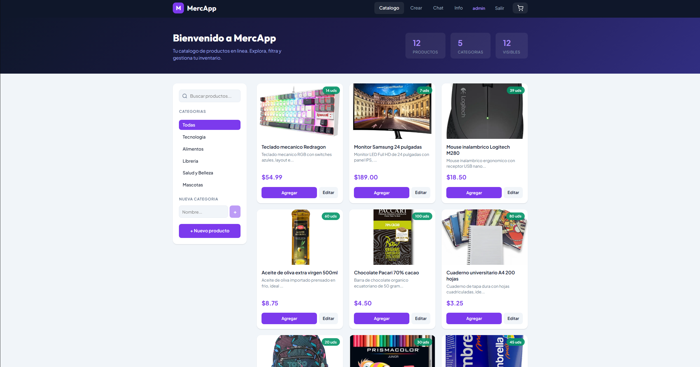
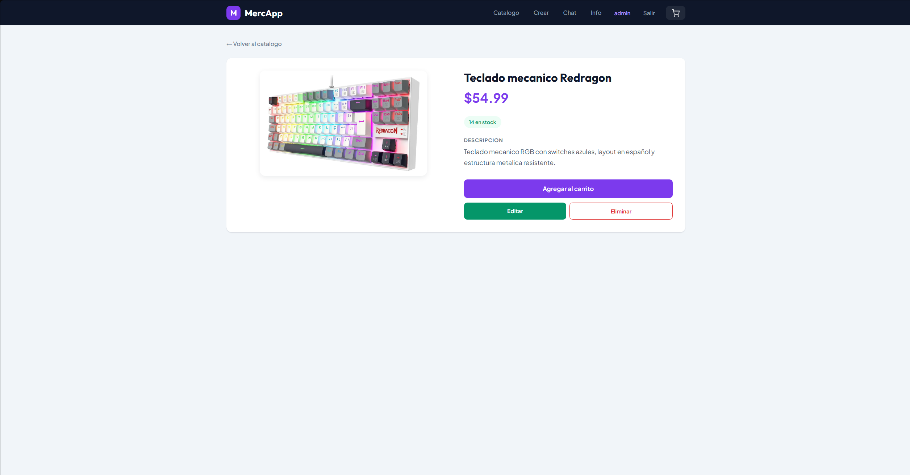
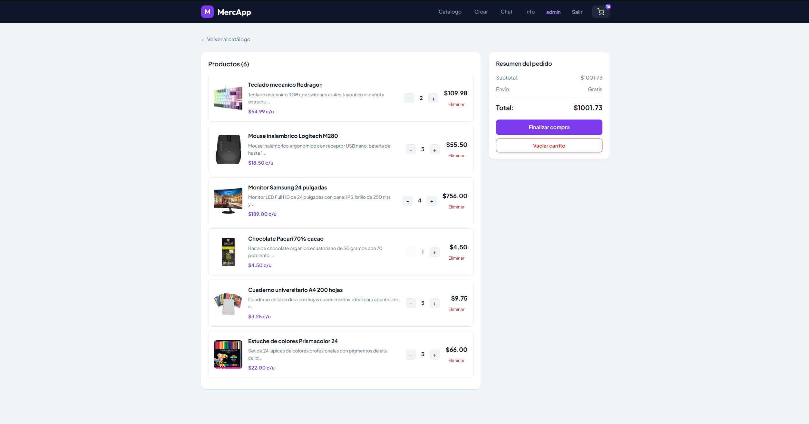
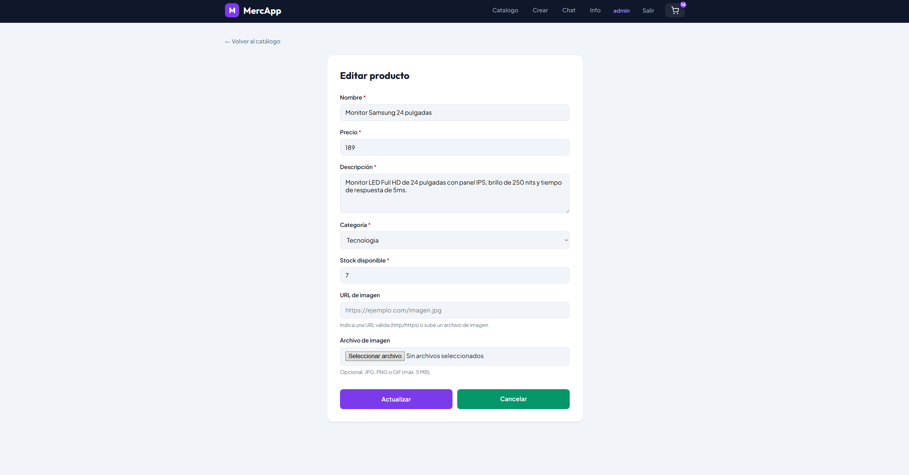

# MercApp - Tienda en Línea SPA con Despliegue en Producción

**Estudiante:** Mateo Carranza
**Carrera:** Ingeniería en Software
**Universidad:** Universidad Politécnica Salesiana
**Materia:** Aplicaciones Web - Unidad 4 (Despliegue y publicación)
**Repositorio:** [github.com/wildmaster18/MercApp-deploy](https://github.com/wildmaster18/MercApp-deploy)

---

## Enlaces del proyecto desplegado

| Componente                | URL                                                |
| ------------------------- | -------------------------------------------------- |
| Frontend (Netlify)        | https://iridescent-profiterole-b5ffbd.netlify.app  |
| API REST (Railway)        | https://mercapp-api-production-56c5.up.railway.app |
| Micrositio (GitHub Pages) | https://wildmaster18.github.io/MercApp-deploy/     |
| Repositorio (GitHub)      | https://github.com/wildmaster18/MercApp-deploy     |

**Credenciales de la aplicación en producción:** usuario `admin`, contraseña `admin123`.

La aplicación redirige al login al entrar, así que estas credenciales son necesarias para revisar el catálogo, el CRUD y el resto de funciones.

---

## Qué es MercApp

MercApp es una tienda en línea compuesta por dos partes que trabajan juntas. La primera es una API REST hecha con Node.js, Express y MongoDB que almacena los productos, categorías y usuarios. La segunda es una SPA (Single Page Application) hecha con Vue 3 que se conecta a esa API y presenta toda la interfaz al usuario sin recargar la página.

El backend conserva también las vistas Handlebars de la Unidad 2 (login, productos, chat) y suma una capa API REST que consume la SPA. El sistema incluye autenticación de usuarios, gestión CRUD de productos con imágenes, filtrado por categorías, búsqueda por nombre, carrito de compras con descuento de stock y un chat en tiempo real con Socket.io.

En esta Unidad 4 el proyecto de la Unidad 3 se llevó a producción sobre cuatro plataformas: la base de datos en MongoDB Atlas, el backend en Railway, el frontend en Netlify y un micrositio de documentación en GitHub Pages.

---

## Arquitectura de despliegue

```
        Usuario (navegador web)
                 |
                 v
   Netlify  ──  SPA Vue 3 (carpeta dist/), HTTPS + CDN
                 |
                 v   peticiones HTTPS, CORS restringido por dominio
   Railway  ──  API REST Express, Helmet + Rate limit + trust proxy
                 |
                 v   cadena mongodb+srv:// con TLS
   MongoDB Atlas  ──  Cluster M0 (productos, categorías, usuarios)


   GitHub Pages  ──  Micrositio /docs (resumen, arquitectura, endpoints, enlaces)
```

El usuario entra al frontend publicado en Netlify, que sirve el build estático de la SPA por HTTPS. La SPA hace peticiones a la API en Railway, también por HTTPS, y el backend responde solo a las peticiones que vienen del dominio de Netlify gracias a la configuración de CORS. La API se conecta a MongoDB Atlas mediante una cadena `mongodb+srv://` que fuerza TLS. El micrositio en GitHub Pages es independiente y solo sirve como documentación pública del proyecto.

---

## Cómo ejecutar el proyecto en local

### Requisitos

Se necesita tener instalado Node.js v18 o superior y MongoDB.

### Backend

```
cd backend
npm install
npm run seed
npm run dev
```

Si se quiere una instalación exacta según el lockfile, se puede usar `npm ci` en lugar de `npm install`.

El seed crea 5 categorías, 12 productos y un usuario de prueba. El servidor queda disponible en `http://localhost:3000`.

**Credenciales de prueba:** usuario `admin`, contraseña `admin123`.

Crear un archivo `.env` en la carpeta backend (ver `.env.example`):

```
PORT=3000
MONGODB_URI=mongodb://127.0.0.1:27017/mercapp
SESSION_SECRET=claveSecretaMercApp2026
FRONTEND_URL=http://localhost:5173
NETLIFY_URL=
```

### Frontend

En otra terminal:

```
cd frontend
npm install
npm run dev
```

Abrir `http://localhost:5173` en el navegador. La app redirige al login. Ingresar con `admin / admin123`.

### Build de producción del frontend

```
cd frontend
npm run build
npm run preview
```

El comando `build` genera la carpeta `dist/` que es la que se publica en Netlify. Antes de construir, se define `VITE_API_URL` en un archivo `.env` o `.env.local` apuntando a la URL del API en Railway.

---

## Proceso de despliegue

### Fase 1 - Base de datos (MongoDB Atlas)

Se creó un cluster gratuito M0 en una región cercana al backend y un usuario de base de datos con rol de lectura y escritura. Se habilitó el acceso de red y se copió la cadena de conexión `mongodb+srv://`, que luego se configuró como `MONGODB_URI` en el backend.

La carga inicial de datos (5 categorías y 12 productos) se hizo mediante el script `seed-api.js`, que inserta los registros llamando directamente a la API ya desplegada en producción. Se optó por este método porque la conexión local hacia Atlas fallaba por restricciones de la red, y de esta forma los datos llegaron a Atlas a través del backend en Railway.

### Fase 2 - Backend (Railway)

El backend se conectó a un repositorio de GitHub que Railway construye y despliega automáticamente con cada push. El build se hace con Nixpacks, que detecta el stack de Node.js sin configuración adicional. Railway asigna el puerto por su cuenta (el servidor lo lee desde `process.env.PORT`) y genera un dominio público con HTTPS.

Se configuraron las variables de entorno necesarias para producción: `MONGODB_URI`, `SESSION_SECRET`, `FRONTEND_URL`, `NETLIFY_URL` y `NODE_ENV=production`.

### Fase 3 - Frontend (Netlify)

Se creó un archivo `.env.local` con `VITE_API_URL` apuntando a la URL del API en Railway, se ejecutó `npm run build` para generar la carpeta `dist/` y esa carpeta se publicó arrastrándola manualmente a Netlify. Se agregó un archivo `_redirects` con la regla `/*    /index.html   200` para que las rutas de la SPA (Vue Router) funcionen al recargar la página y no devuelvan un 404.

### Fase 4 - Micrositio (GitHub Pages)

Se activó GitHub Pages en el repositorio apuntando a la rama `main` y la carpeta `/docs`. El micrositio contiene un resumen técnico del sistema, el diagrama de la arquitectura de despliegue, una tabla con los endpoints del API y los enlaces a Netlify, Railway y el repositorio. Queda servido por HTTPS de forma pública.

---

## Variables de entorno

### Backend (Railway, producción)

| Variable         | Descripción                                          |
| ---------------- | ---------------------------------------------------- |
| `MONGODB_URI`    | Cadena `mongodb+srv://` del cluster de Atlas         |
| `SESSION_SECRET` | Clave secreta para firmar las sesiones               |
| `FRONTEND_URL`   | Origen permitido en CORS (dominio de Netlify)        |
| `NETLIFY_URL`    | Origen adicional permitido en CORS                   |
| `NODE_ENV`       | Se fija en `production` para activar cookie segura   |
| `PORT`           | Lo asigna Railway automáticamente (`process.env.PORT`) |

### Frontend (Netlify, build)

| Variable       | Descripción                                  |
| -------------- | -------------------------------------------- |
| `VITE_API_URL` | URL pública del API en Railway que consume la SPA |

Ningún archivo `.env` real se sube al repositorio. Se incluyen archivos `.env.example` en backend y frontend con la estructura de las variables pero sin credenciales.

---

## Seguridad y configuración de entorno

- **Secretos fuera del repositorio:** los `.gitignore` excluyen `node_modules`, `.env`, `dist` y `uploads`. El repositorio incluye `.env.example` en lugar de los valores reales.
- **HTTPS:** activo en las tres plataformas (Netlify, Railway y GitHub Pages).
- **CORS restringido por dominio:** el backend lee `FRONTEND_URL` y `NETLIFY_URL` y solo acepta peticiones desde esos orígenes, en lugar de usar un comodín `*`.
- **Helmet:** añade cabeceras de seguridad HTTP.
- **Rate limiting:** limita la cantidad de peticiones a las rutas `/api` para evitar abusos.
- **express-validator:** valida y sanitiza los datos que entran a la API.
- **trust proxy:** habilitado para que el backend funcione correctamente detrás del proxy de Railway (necesario para que el rate limit y la cookie segura detecten bien la conexión HTTPS).
- **Cookie de sesión:** en producción se configura con `secure` y `sameSite: none` para que funcione entre los dominios de Netlify y Railway.
- **Allowlist de Atlas:** está en `0.0.0.0/0`. Railway en plan gratuito no expone IPs de salida estáticas, por lo que la allowlist debe permitir cualquier origen para que el backend pueda conectarse. El acceso a la base de datos queda protegido por el usuario y contraseña propios de Atlas, la cadena `mongodb+srv://` que fuerza TLS, y un `SESSION_SECRET` robusto.
- **Verificación TLS:** la conectividad con Atlas se comprueba de forma funcional con el endpoint `/api/health`, que reporta `"database": "conectada"`, y con la carga de datos vía `seed-api.js` contra la API en producción.

---

## Rutas de la API

| Método | Ruta               | Descripción                      |
| ------ | ------------------ | -------------------------------- |
| GET    | /api/health        | Estado del servidor y la BD      |
| GET    | /api/products      | Lista todos los productos        |
| GET    | /api/products/:id  | Obtiene un producto por su ID    |
| POST   | /api/products      | Crea un producto nuevo           |
| PUT    | /api/products/:id  | Actualiza un producto completo   |
| PATCH  | /api/products/:id  | Actualiza campos parciales       |
| DELETE | /api/products/:id  | Elimina un producto              |
| GET    | /api/categories    | Lista las categorías             |
| POST   | /api/categories    | Crea una categoría nueva         |
| POST   | /api/checkout      | Procesa compra y descuenta stock |
| POST   | /api/auth/register | Registra un usuario nuevo        |
| POST   | /api/auth/login    | Inicia sesión                    |
| POST   | /api/auth/logout   | Cierra sesión                    |
| GET    | /api/auth/me       | Devuelve el usuario autenticado  |

Las rutas de productos validan los datos con express-validator. Los errores devuelven códigos 400 (validación), 404 (no encontrado) o 500 (servidor).

---

## Rutas del frontend (Vue Router)

| Ruta              | Vista                    | Carga  |
| ----------------- | ------------------------ | ------ |
| /                 | Catálogo de productos    | Normal |
| /login            | Inicio de sesión         | Lazy   |
| /register         | Registro de usuario      | Lazy   |
| /chat             | Chat en tiempo real      | Lazy   |
| /product/new      | Formulario de creación   | Normal |
| /product/:id      | Detalle del producto     | Normal |
| /product/:id/edit | Formulario de edición    | Normal |
| /cart             | Carrito de compras       | Lazy   |
| /about            | Información del proyecto | Lazy   |
| /\*               | Página 404               | Lazy   |

Las rutas marcadas como Lazy se cargan bajo demanda con `() => import(...)`. La app usa `<Suspense>` en el componente raíz con un fallback de carga mientras se resuelven. Un guard de navegación protege todas las rutas excepto `/login` y `/register`, redirigiendo a la pantalla de inicio de sesión si no hay usuario autenticado. Al estar en producción, el archivo `_redirects` se encarga de que estas rutas no devuelvan 404 al recargar.

---

## Stack tecnológico

### Backend

| Tecnología        | Versión | Uso                       |
| ----------------- | ------- | ------------------------- |
| Node.js           | v18+    | Entorno de ejecución      |
| Express           | 5.2.1   | Framework HTTP            |
| MongoDB Atlas     | v6+     | Base de datos en la nube  |
| Mongoose          | 9.6.2   | ODM para MongoDB          |
| express-validator | 7.3.2   | Validación de datos       |
| Multer            | 2.1.1   | Carga de imágenes         |
| bcrypt            | 6.0.0   | Hash de contraseñas       |
| express-session   | 1.19.0  | Sesiones de usuario       |
| Socket.io         | 4.8.3   | Chat en tiempo real       |
| cors              | 2.8.6   | Peticiones cross-origin   |
| helmet            | 8.x     | Cabeceras de seguridad    |
| express-rate-limit| 8.x     | Límite de peticiones      |
| dotenv            | 17.4.2  | Variables de entorno      |
| nodemon           | 3.1.10  | Recarga en desarrollo     |

### Frontend

| Tecnología       | Versión | Uso                                  |
| ---------------- | ------- | ------------------------------------ |
| Vue 3            | 3.5.34  | Framework reactivo (Composition API) |
| Vue Router       | 5.0.7   | Navegación SPA                       |
| Pinia            | 3.0+    | Estado global del carrito            |
| Vite             | 8.0.13  | Bundler y servidor de desarrollo     |
| socket.io-client | 4.8.3   | Chat desde la SPA                    |

---

## Estructura de carpetas

```
MercApp-deploy/
├── backend/
│   ├── config/            database.js, multer.js
│   ├── controllers/       authController.js, productoController.js, chatController.js
│   ├── middlewares/        verificarSesion.js
│   ├── models/            Producto.js, Categoria.js, Usuario.js
│   ├── public/            css/, js/chat.js, images/default.jpg
│   ├── routes/            api.js, authRoutes.js, chatRoutes.js, prodRoutes.js
│   ├── uploads/           (imágenes subidas por el usuario)
│   ├── views/             (plantillas Handlebars de la Unidad 2)
│   ├── app.js             Servidor principal con CORS, Helmet y trust proxy
│   ├── seed.js            Datos iniciales para entorno local
│   ├── seed-api.js        Carga de datos contra la API en producción
│   └── .env.example
├── frontend/
│   ├── public/            _redirects para el fallback de la SPA en Netlify
│   ├── src/
│   │   ├── components/    NavBar, ProductCard, CartItem, LoadingFallback
│   │   ├── composables/   useFetch, useProducts, useCart
│   │   ├── router/        index.js con guard de autenticación
│   │   ├── views/         Home, ProductoDetalle, ProductoForm, CarritoView,
│   │   │                  LoginView, RegistroView, ChatView, AboutView, NotFoundView
│   │   ├── config.js      URL base del API centralizada (lee VITE_API_URL)
│   │   ├── App.vue        Componente raíz con Suspense
│   │   ├── main.js        Registra Vue, Pinia y Router
│   │   └── style.css      Variables CSS globales
│   └── .env.example
├── docs/                  Micrositio publicado en GitHub Pages
│   ├── index.html
│   ├── style.css
│   └── screenshots/
├── readme.txt             URL del repositorio
└── README.md
```

---

## Qué se implementó

### API y modelos de datos

El backend expone 14 endpoints RESTful. Los modelos Producto (nombre, precio, descripción, imagen, stock, categoryId) y Categoria (idCat, nombre) se definen con Mongoose. El seed local puebla la base con 12 productos en 5 categorías y un usuario admin, y el script `seed-api.js` hace lo mismo contra la API en producción.

### Endpoint de salud

Se agregó `GET /api/health` para verificar en producción que el servidor responde y que la conexión con la base de datos está activa. Devuelve el estado, el estado de la BD y el uptime, y sirve como prueba rápida de que el despliegue en Railway funciona.

### SPA Vue 3 con Vite

El frontend usa SFCs (Single File Components) con la Composition API. El alias `@` apunta a `src/` y existe un archivo `config.js` que centraliza la URL base del API leyendo `VITE_API_URL`, de modo que el mismo código funciona en local y en producción solo cambiando la variable.

### Navegación SPA y carga diferida

Vue Router maneja 10 rutas, incluyendo rutas dinámicas y una ruta catch-all para el 404. Seis vistas se cargan de forma diferida con `() => import(...)` y el componente raíz envuelve el `<router-view>` en `<Suspense>` con `LoadingFallback`. Este lazy loading mejora el tiempo de carga inicial de la SPA en producción.

### Búsqueda, filtros y componentes

La vista Home consume `GET /api/products` y `GET /api/categories`. Un `computed` aplica el texto del buscador y la categoría seleccionada sobre la lista. `ProductCard` recibe un prop `product` y emite eventos hacia su vista padre.

### Composables y peticiones HTTP

`useFetch` es genérico y maneja `data`, `loading` y `error`. `useProducts` lo consume y expone `fetchProducts`, `fetchProductById`, `createProduct`, `updateProduct` y `deleteProduct`, todas apuntando a la URL del API en producción.

### Carrito con Pinia

El estado del carrito se gestiona con un store de Pinia. Soporta agregar, quitar, modificar cantidades, calcular el total con `computed`, persistir en `localStorage` y descontar stock en MongoDB al finalizar la compra mediante `POST /api/checkout`.

### Despliegue y documentación

El proyecto quedó publicado en las cuatro plataformas (Atlas, Railway, Netlify y GitHub Pages) bajo HTTPS, con CORS restringido por dominio, variables de entorno gestionadas fuera del repositorio y el micrositio de documentación en `/docs`.

---

## Problemas encontrados y soluciones

Durante el despliegue surgieron varios problemas que se resolvieron revisando los logs y el comportamiento de la aplicación en producción:

- **Error 404 al editar productos:** una de las peticiones del frontend no incluía el prefijo `/api`, por lo que la edición devolvía 404. Se corrigió la URL para que apuntara a la ruta correcta del API.
- **Cookie de sesión entre dominios:** como el frontend (Netlify) y el backend (Railway) están en dominios distintos, la cookie de sesión no se enviaba. Se configuró la cookie con `secure` y `sameSite: none` en producción para que el navegador la acepte en peticiones cross-origin.
- **Aplicación detrás de proxy:** Railway sirve la aplicación detrás de un proxy, lo que hacía que el backend no detectara bien las conexiones HTTPS. Se agregó `app.set('trust proxy', 1)` para que el rate limit y la cookie segura funcionaran correctamente.
- **Puerto al generar el dominio en Railway:** al inicio el dominio público se generó con un puerto equivocado y la API no respondía. Se resolvió regenerando el dominio con el puerto que Railway asigna automáticamente.
- **Conexión local a Atlas bloqueada:** la red local no permitía conectarse directamente a Atlas, así que los datos iniciales se cargaron mediante `seed-api.js` llamando a la API ya desplegada en lugar de insertarlos desde la máquina local.

---

## Capturas de pantalla

### Catálogo



### Detalle de producto



### Carrito de compras



### Formulario de producto



---

## Comandos útiles

### Backend

| Comando         | Descripción                              |
| --------------- | ---------------------------------------- |
| `npm install`   | Instala dependencias                     |
| `npm ci`        | Instalación exacta según el lockfile     |
| `npm run dev`   | Inicia con nodemon                       |
| `npm start`     | Inicia con node (producción)             |
| `npm run seed`  | Puebla la base de datos local            |

### Frontend

| Comando          | Descripción                |
| ---------------- | -------------------------- |
| `npm install`    | Instala dependencias       |
| `npm run dev`    | Inicia con Vite            |
| `npm run build`  | Genera el build de producción (dist/) |
| `npm run preview`| Previsualiza el build      |

---

## Problemas frecuentes (entorno local)

**MongoDB no conecta:** verificar que el servicio esté corriendo con `mongod` o revisar en Servicios de Windows que MongoDB Server esté activo.

**El frontend muestra error de conexión:** el backend debe estar corriendo en el puerto 3000 antes de abrir la SPA, o `VITE_API_URL` debe apuntar a la API en producción.

**Las imágenes no cargan:** verificar que la carpeta `backend/uploads/` exista. Los productos del seed usan una imagen placeholder por defecto.

---

## Checklist de despliegue

- [x] Repositorio público en GitHub con README e instrucciones de build/despliegue
- [x] `.env.example` en backend y frontend, sin credenciales reales
- [x] `.gitignore` que excluye node_modules, .env, dist y uploads
- [x] MongoDB Atlas: cluster M0 con datos, usuario de BD y TLS por la cadena mongodb+srv
- [x] Railway: API desplegada con MONGODB_URI, SESSION_SECRET, CORS y NODE_ENV
- [x] Endpoint de salud `/api/health` respondiendo OK
- [x] CRUD de productos y categorías funcionando en producción
- [x] Netlify: SPA publicada con `_redirects` para el fallback de rutas
- [x] CORS restringido al dominio de Netlify, sin errores de preflight
- [x] HTTPS activo en las tres plataformas
- [x] GitHub Pages: micrositio con arquitectura, endpoints y enlaces
- [x] `readme.txt` con la URL del repositorio

---

Proyecto desarrollado con fines académicos — Universidad Politécnica Salesiana, 2026.
